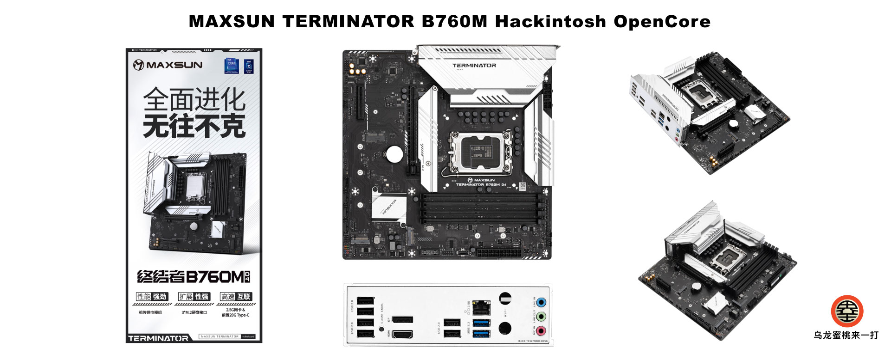

## 铭瑄-终结者 B760M 黑苹果 OpenCore EFI



### OpenCore

[OpenCore 1.0.4](https://github.com/acidanthera/OpenCorePkg)

### macOS

- macOS Monterey 12.x
- macOS Ventura  13.x 
- macOS Sonoma 14.x
- macOS Sequia 15.x

### 硬件

- 主    板: Maxsun MS-Terminator B760M D4
- 芯片组: B760
- Bios 版本: H5.2G（07/15/2023）
- 处理器: 英特尔12代 i5-12400F
- 内    存: 海盗船复仇者LPX 16GB*2 DDR4 3600MHz
- 硬    盘: 西部数据 SN730 512GB
- 硬    盘: 西部数据 1TB 7200 RPM HDD
- 独    显:  蓝宝石 AMD Radeon RX5500XT 8GB 白金
- 声    卡: 瑞昱 ALC897
- 有线网卡: 瑞昱 8125 2.5GbE
- 无线网卡: BCM94360CD
- 机    箱:  乔思伯U4
- 电    源: 安钛克HCG 750W

### BIOS设置

```

Advanced
|-- CPU Configuration
    |-- CFG LOCK:禁用
|-- Chipset Configuration
    |-- VT-d：开启
    |-- Above 4G decoding：开启
    |-- Resizable Bar：关闭
|-- Chipset Configuration
    |-- XHCI Hand-off：开启
Startup
|-- Fast Boot：关闭
|-- CSM Support：关闭
Security
|-- Secure Boot
    |-- Secure Boot Mode：Custom
    |-- Key Management：Clear Secure Boot Keys
```

### 注意事项

 - 安装成功后必须使用 [OCAuxiliaryTools](https://github.com/ic005k/OCAuxiliaryTools) 生成你自己的 SMBIOS
 - EFI中使用英特尔无线[itlwm](https://github.com/OpenIntelWireless/itlwm)驱动，请自行下载[HeliPort,dmg](https://github.com/OpenIntelWireless/HeliPort/releases/tag/v1.5.0)连结wifi

### 参考内容

[1.黑苹果安装过程演示](https://hackintosh.club/d/10000060)

[2.英特尔无线网卡WiFi驱动](https://hackintosh.club/d/10000015)

[3.英特尔无线网卡蓝牙驱动](https://hackintosh.club/d/10000017)

[4.我的B站黑苹果教程](https://space.bilibili.com/244390800/video)

[6.黑果之家](https://hackintosh.club)

### 联系我们

QQ群: 23304408


### 常用工具

- [Hackintool](https://github.com/headkaze/Hackintool) 
- [OCAuxiliaryTools](https://github.com/ic005k/OCAuxiliaryTools) AKA `OCAT`.
- [OpenCore Configurator](https://mackie100projects.altervista.org/opencore-configurator/) AKA `OCC`.
- [gibMacOS](https://github.com/corpnewt/gibMacOS) Build your own MacOS image.
- [ProperTree](https://github.com/corpnewt/ProperTree) Plist editor.